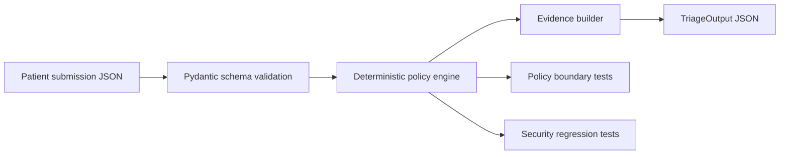

# Pre-Op Triage Take-Home

## Objective

Implement `triage_submission(...)` in `core.py` - it is a pre-op triage function for a single submission package. It is currently a naive LLM-based solution that makes a real model API call. The starter implementation intentionally does not follow some best practices in using the OpenAI API. You may use whatever file structure makes sense for your solution.

Your output must match this schema:

- `decision`: `READY | NEEDS_FOLLOW_UP | NOT_CLEARED`
- `issues[]`: category + evidence (`source`, `details`)
- `explanation`

## What Is Provided

- `data/patients_sample_50.jsonl` includes:
  - `case_id`
  - `submission`
  - `expected_output`
- `run_baseline.py` runs your `triage_submission` implementation and writes outputs.
- `run_evals.py` scores outputs against provided `expected_output` and can run determinism checks.

## Completion

Note: this exercise is evaluated on engineering judgment. You may not reach a 100% score, and that is OK! We are looking to understand how you approached the problem and designed a working solution.

## Setup

Confirm `uv` is installed.

```bash
uv --version
```

This implementation is deterministic and does not call an LLM at runtime, so no OpenAI API key is required for the baseline, scoring, or determinism workflows.

## Architecture



## Recommended Workflow

1. Review `triage_submission` in `core.py`.
2. Run baseline outputs:

```bash
make baseline
```

3. Run eval scoring:

```bash
make evals
```

4. Run determinism check:

```bash
make determinism
```

5. Print score:

```bash
make score
```

6. View the interactive report (TUI):

```bash
make report
```

This opens a terminal UI (`view_report.py`) that shows per-case results side-by-side with oracle expectations. You can browse records, see metric pass/fail status, and inspect submission data. Press `f` on a metric row to filter the case list to failures. Press `q` to quit.

## Implementation Approach

`triage_submission(...)` is implemented as a deterministic policy engine rather than a single model call. The policy is explicit, so deterministic rules provide stronger reproducibility, easier debugging, and safer handling of patient-like data.

The engine:

- Validates the submission with the provided Pydantic schema.
- Applies the appendix policy as the only source of truth.
- Returns fixed-schema `TriageOutput` objects.
- Uses stable issue categories and evidence paths compatible with the eval harness.
- Fails closed for missing/unknown data needed to evaluate a rule.
- Treats clinical note text as untrusted input; note text is used only as evidence, never as instructions.
- Requires clear anticoagulation plans and rejects vague/negated language such as pending recommendations or “no clear hold/resume guidance.”

Security/robustness choices influenced by AI application security experience:

- No runtime API calls or PHI-like data egress.
- No prompt-injection exposure in the core decision path.
- No dynamic code execution or shelling out from patient input.
- Deterministic serialization via Pydantic models.
- Minimal dependency surface: existing starter dependencies only.

See also:

- [`SECURITY.md`](SECURITY.md) for OWASP LLM Top 10 and OWASP Web/Application Top 10 mapping, threat model, PII/PHI considerations, and security-focused test notes.
- [`docs/POLICY_COVERAGE.md`](docs/POLICY_COVERAGE.md) for a policy-to-code/test coverage matrix and adversarial robustness summary.
- [`docs/DESIGN_DECISIONS.md`](docs/DESIGN_DECISIONS.md) for key tradeoffs, including why deterministic logic is used and how an LLM could be safely introduced later.
- [`docs/PRODUCTION_HARDENING.md`](docs/PRODUCTION_HARDENING.md) for API/authZ, PII minimization, logging, and deployment hardening recommendations.

## Tests

Run all tests with:

```bash
make test
```

Run focused security regression tests:

```bash
make security-test
```

Run focused policy boundary tests:

```bash
make policy-test
```

## Known Limitations

- This is not a clinical safety certification or medical guideline engine; it implements only the supplied assignment policy.
- Document classification is heuristic and intentionally scoped to the provided policy and dataset patterns.
- No auth, tenant isolation, database, encryption-at-rest, or audit logging layer is implemented because the starter is a local CLI/eval harness.
- Evidence details may contain patient-like excerpts; production display/logging should be role-gated and minimized.
- A perfect sample score does not prove general medical correctness beyond the stated policy.

## Outputs

- Baseline outputs: `data/baseline_outputs.jsonl`
- Eval report: `data/eval_report.json`
- Determinism report: `data/determinism_report.json`

## Configurable Variables

- `MODEL` (default `gpt-4.1-mini`)
- `INPUT` (default `data/patients_sample_50.jsonl`)
- `OUTPUT` (default `data/baseline_outputs.jsonl`)
- `REPORT` (default `data/eval_report.json`)
- `DETERMINISM_REPORT` (default `data/determinism_report.json`)
